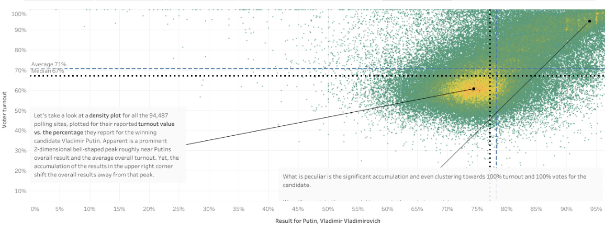
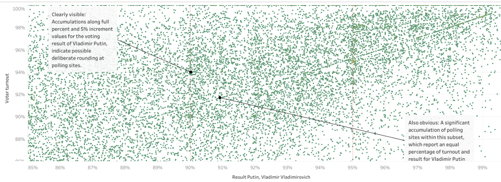

# Russian Presidential elections - A Data Visualization Project in Tableau
*created during the Data Analytics Full Time bootcamp at Ironhack Berlin, June 2020*

A rough data analysis of the Russian presidential election results (with an emphasis on statistical anomalies) with Tableau. Find the Tableau File [here](https://public.tableau.com/profile/n1oftheabove#!/vizhome/russian_pres_elections/Story1?publish=yes)

## Datasource

This analysis uses a [kaggle dataset](https://www.kaggle.com/valenzione/russian-presidental-elections-2018-voting-data). The data were originally scraped by that user from official regional election commitees websites and contain voting results for ca 94,500 voting sites from all over the Russian Federation. Although the results calculated from these raw data are pretty close to the offical result, the raw data are "preliminary", "not final" data.

## Results

Peculiarities in the data indicate vote tampering (by any entity/entities whatsoever): For example: Although the underlying database contains only the absolute vote counts for all the voting sites regarding **votes for all candidates**, **number of voter turnout**, **number of invalid votest**, etc., peaks at full 5% increments for voter turnout and for the winning candidate are apparent in the visualizations. Also, the scatterplot for all voting sites, in which voter turnout vs. result in % (for Putin) is plotted shows voting sites conspicuously lined up on lines that mark an equal number of turnout and result for Putin (e.g. 95% turnout and 95% result for Putin) in the region of voter turonout > 90% & result for Putin > 90%.  This most likely cannot be explained by statistical randomness.

**Fig. 1** - Voter turnout vs. result for Putin for all election sites. 

**Fig. 2** - Same like Fig 1, but zoomed into the upper right corner.

When plotting for every voting site the result in percent for a candidate or party against the voter turnout in percent at that voting site, possible irregularities can be visualized as deviations from a 2-dimensional gauss form in this density plot (Fig. 1). A statistical clustering of points near the 100% turnout/100% votes-corner in that scatterplot for example is regarded as a hint for ballot stuffing (as an appropriate scientific publication, see for example Statistical detection of systematic election irregularities by Klimek et. al, PNAS, 2012, [link](http://www.pnas.org/content/109/41/16469)).

My first analysis revealed irregularities not only for the results of the winning candidate Putin Vladimir Vladimirovich, but also for at least one other candidate (Grudinin Pavel Nikolayevich).

This is a rough visualization and descriptive statistical analysis inspired by academic research regarding voting fraud detection with statistical means. A more thorough look into the data and more so an analysis of the final officially released data is necessary to draw proper conclusions.
